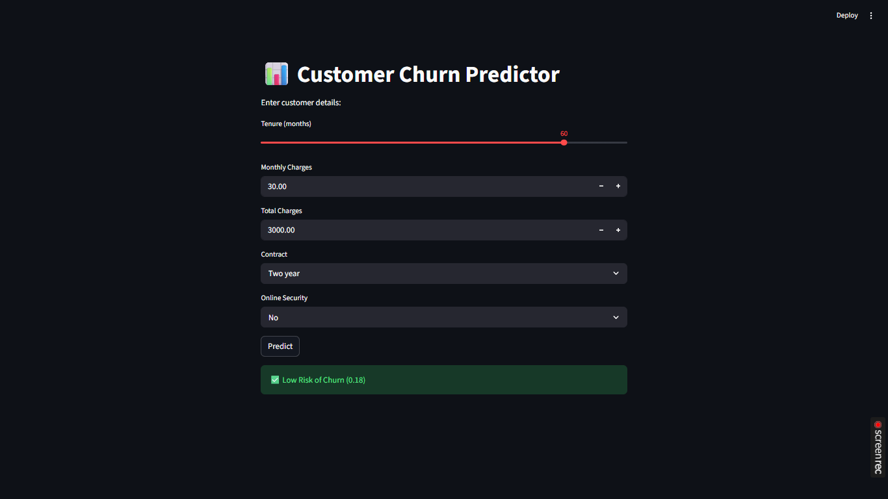
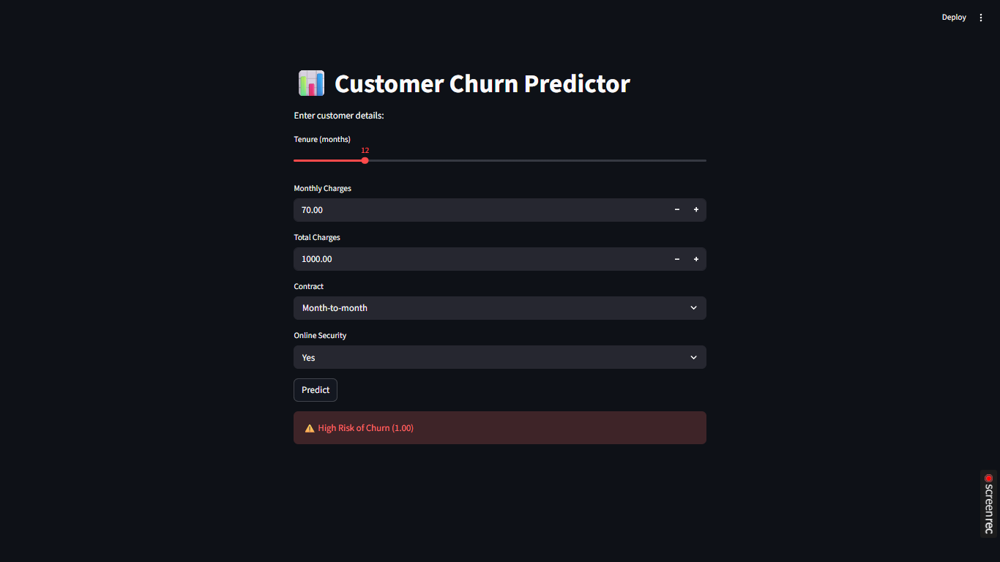

# 📊 Customer Churn Prediction App

## 🚀 Project Overview

This project focuses on predicting customer churn using machine learning techniques. The goal is to identify customers who are likely to leave a telecom service so that businesses can take proactive retention actions.

The model is built using **XGBoost** and deployed as an interactive **Streamlit web application** for real-time predictions.

---

## 🎯 Problem Statement

Customer churn is a major challenge for subscription-based businesses. Retaining existing customers is more cost-effective than acquiring new ones.

This project aims to:

* Predict whether a customer will churn
* Identify key factors influencing churn
* Provide actionable insights for business decisions

---

## 🧠 Key Features

* End-to-end ML pipeline (data cleaning → modeling → deployment)
* Handles imbalanced data using **SMOTE**
* Optimized for **recall** to detect maximum churn customers
* Uses **threshold tuning** for better business outcomes
* Model interpretability using **SHAP**
* Interactive UI using Streamlit

---

## 📂 Dataset

* Telco Customer Churn Dataset (Kaggle)
* Contains customer demographics, account details, and service usage

---

## ⚙️ Tech Stack

* Python
* Pandas, NumPy
* Scikit-learn
* XGBoost
* SHAP (Model Explainability)
* Streamlit (Deployment)

---

## 🔄 Workflow

1. Data Cleaning

   * Handled missing values
   * Converted data types

2. Feature Engineering

   * Encoded categorical variables
   * One-hot encoding

3. Handling Imbalance

   * Applied SMOTE to balance churn classes

4. Model Building

   * Trained using XGBoost
   * Tuned hyperparameters

5. Model Evaluation

   * Focused on Recall, Precision, F1-score
   * Adjusted decision threshold (0.3)

6. Model Explainability

   * Used SHAP to identify key churn drivers

7. Deployment

   * Built interactive app using Streamlit

---

## 📊 Key Insights

* Customers with **high monthly charges** are more likely to churn
* **Short tenure** customers have higher churn probability
* **Long-term contracts** significantly reduce churn
* Additional services like **online security** reduce churn

---

## 🖥️ Streamlit App

### ▶️ Run Locally

```bash
streamlit run app.py
```

---

## 📦 Installation

```bash
pip install -r requirements.txt
```

---

## 📁 Project Structure

```
churn_app/
│
├── app.py
├── model.pkl
├── scaler.pkl
├── features.pkl
├── requirements.txt
├── README.md
└── .gitignore
```

---

## 🎯 Model Performance

* Recall (Churn): ~0.82
* Accuracy: ~0.73

The model is optimized to prioritize **recall**, ensuring most churn customers are identified.

---

## 📸 Screenshots

### 🟢 Low Churn Prediction


### 🔴 High Churn Prediction


## 📬 Contact

Feel free to connect for collaboration or feedback!